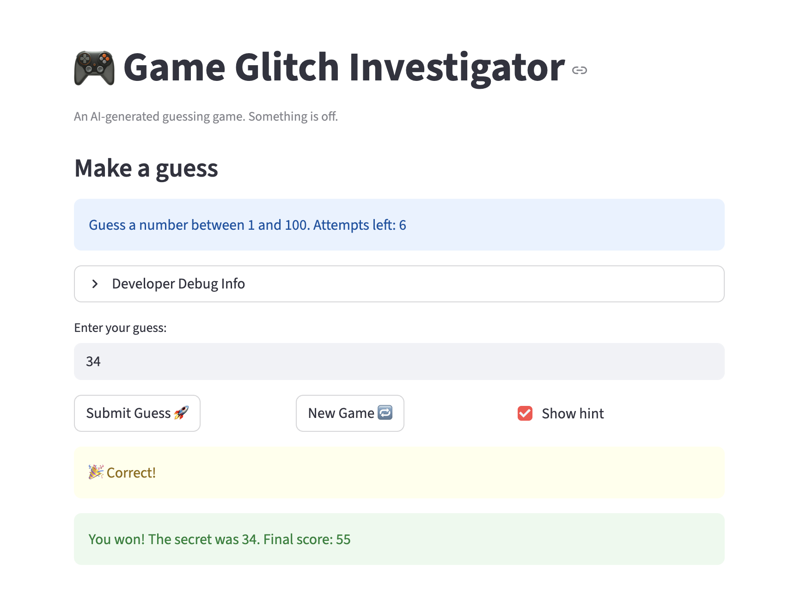

# 🎮 Game Glitch Investigator: The Impossible Guesser

## 🚨 The Situation

You asked an AI to build a simple "Number Guessing Game" using Streamlit.
It wrote the code, ran away, and now the game is unplayable.

- You can't win.
- The hints lie to you.
- The secret number seems to have commitment issues.

## 🛠️ Setup

1. Install dependencies: `pip install -r requirements.txt`
2. Run the broken app: `python -m streamlit run app.py`

## 🕵️‍♂️ Your Mission

1. **Play the game.** Open the "Developer Debug Info" tab in the app to see the secret number. Try to win.
2. **Find the State Bug.** Why does the secret number change every time you click "Submit"? Ask ChatGPT: _"How do I keep a variable from resetting in Streamlit when I click a button?"_
3. **Fix the Logic.** The hints ("Higher/Lower") are wrong. Fix them.
4. **Refactor & Test.** - Move the logic into `logic_utils.py`.
   - Run `pytest` in your terminal.
   - Keep fixing until all tests pass!

## 📝 Document Your Experience

- [x] **Game's purpose:** A number guessing game where the player tries to guess a randomly chosen secret number within a limited number of attempts. The player picks a difficulty (Easy: 1–20, Normal: 1–100, Hard: 1–50), receives Higher/Lower hints after each guess, and earns a score based on how quickly they guess correctly.

- [x] **Bugs found:**
  1. **State bug** — The secret number regenerated on every button click because `st.session_state` was not used to persist it across reruns.
  2. **Backwards hints** — The `check_guess` function returned "Too High / Go LOWER" when the guess was too low, and vice versa.
  3. **Hardcoded range in UI message** — The prompt to the player showed a fixed range instead of reflecting the selected difficulty.
  4. **Type inconsistency** — The secret number was sometimes compared as a string and sometimes as an int, causing incorrect comparisons in `check_guess`.
  5. **New Game reset incomplete** — Clicking "New Game" did not reset `attempts`, `score`, `status`, or `history`, so the game state carried over into the new round.

- [x] **Fixes applied:**
  1. Made sure that session state doesn't go away with reruns.
  2. Swapped the return values in `check_guess` so `guess > secret` → "Too High / Go LOWER" and `guess < secret` → "Too Low / Go HIGHER".
  3. Replaced the hardcoded range string in the UI hint with `{low}` and `{high}` variables derived from `get_range_for_difficulty`.
  4. Removed the string-cast branch so `check_guess` always compares integers.
  5. Added full session-state reset (`attempts = 0`, `score = 0`, `status = "playing"`, `history = []`) inside the "New Game" button handler.
  6. Refactored `get_range_for_difficulty`, `parse_guess`, `check_guess`, and `update_score` into `logic_utils.py` and verified them with `pytest`.

## 📸 Demo

## 🚀 Stretch Features

- [ ] [If you choose to complete Challenge 4, insert a screenshot of your Enhanced Game UI here]
      Did not complete challenge 4
